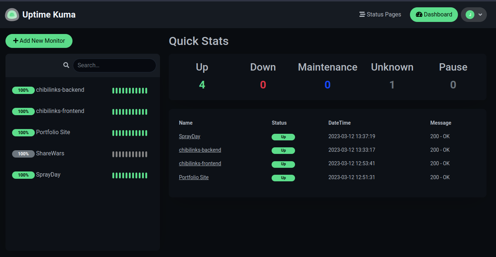

# Uptime-Kuma-Compose
### Description
Docker compose file to run uptime-kuma locally with persistent data. Transcribed from the ` docker run ` command given in the Uptime-Kuma github repo.

### Setup

Pull the image from docker hub

 `docker pull louislam/uptime-kuma`

Run docker compose

 `docker compose up`

Navigate to `http://localhost:3009/` in a browser to configure uptime-kuma

